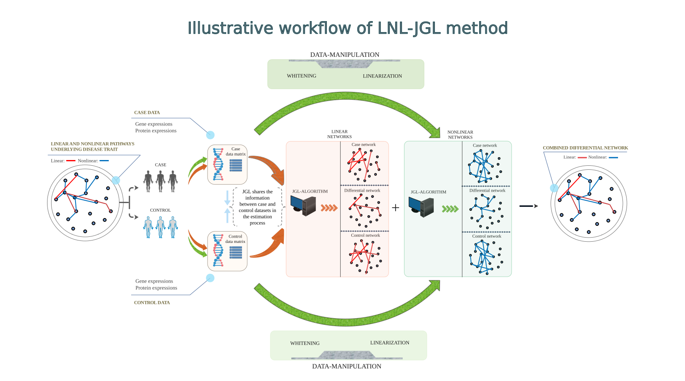

MultiJGL project is about developing a general framework for the inference of multi-dependency (linear and nonlinear) networks across multiple sample groups. The current implementation introduces a nonlinear extension of the popular joint graphical lasso (JGL) enabling the identifcation of both linear and nonlinear dependencies between nodes in a hierarchical manner. 


<!-- GETTING STARTED -->
## Install the package
To install the developer version (status: unreviewed) from github:
```r

require(devtools)
require(dplyr)
devtools::install_github("KontioJuho/multiJGL")
``` 


<!-- USAGE EXAMPLES -->
## Acute myeloid leukemia example: 

**Joint estimation of cytogenetic risk-group specific gene networks** 

In this example,  the multiJGL is applied on the acute myeloid leukemia cohort (The Cancer Genome Atlas) downloaded from Xenahub using the Xenaprep function provided within the package. We define the sample groups for this analysis based on a patient-level cytogenetic risk classes (CRC): adverse, intermediate, favorable) and remove the samples with unknown CRCs.

```r
library(multiJGL)
Xenadata <- multiJGL::Xenaprep("LAML")

Xenadata$clin.molsubtype.mRNA %>% 
  rename(., cytgenrisk = acute_myeloid_leukemia_calgb_cytogenetics_risk_category) %>% 
  filter(., !is.na(cytgenrisk)) -> AMLtcga

AMLgroups <- AMLtcga$cytgenrisk

```
For simplicity, the networks are estimated only over the most frequently mutated genes among AML samples. Such genes and their expression level measurements over AML samples can be extracted from TCGA data, for example, with the maftools R-package as follows:
```r
if (!require("BiocManager", quietly = TRUE))
    install.packages("BiocManager")

BiocManager::install("maftools")

library(maftools)
require(e1071)
#Set path to TCGA LAML MAF file
laml.maf = system.file('extdata', 'tcga_laml.maf.gz', package = 'maftools')
laml.clin = system.file('extdata', 'tcga_laml_annot.tsv', package = 'maftools')

#Query the names of 15 most frequently mutated genes in AML
read.maf(maf = laml.maf, clinicalData = laml.clin) %>% 
  somaticInteractions(maf = , top = 15) -> som_int 

AMLtcga %>%
  dplyr::select(.,som_int$gene1) %>%
  scale(., center = TRUE, scale = TRUE) -> genes

```
Validate the normality assumption with a built-in _data_check_ function and run an appropriate transformation function if needed:
```r
#It seems that five covariates are left-skewed
multiJGL::data_check(genes)

library(e1071)
#It seems that five covariates are left-skewed
apply(genes, 2, function(x) skewness(x)) %>% 
  as.data.frame() %>% 
  filter(. < -1) %>%
  rownames( )  -> skew.genes
#Transformation
genes[,skew.genes] <- scale(log10(max(genes[,skew.genes]+1) - genes[,skew.genes]))

#Recheck
multiJGL::data_check(genes)

  
```
Estimate both linear and nonlinear network structures with _multiJGL_ function (with the default parameter values):
```r
networks <- multiJGL(node.covariates = genes,
                           grouping.factor = AMLgroups,
                           lin_lambda1 = 0.1, lin_lambda2 = 0.025,
                           nonlin_lambda1 = 0.1,nonlin_lambda2 = 0.025)
```


_For more examples, please refer to the [Documentation]()_

<p align="right">(<a href="#top">back to top</a>)</p>
